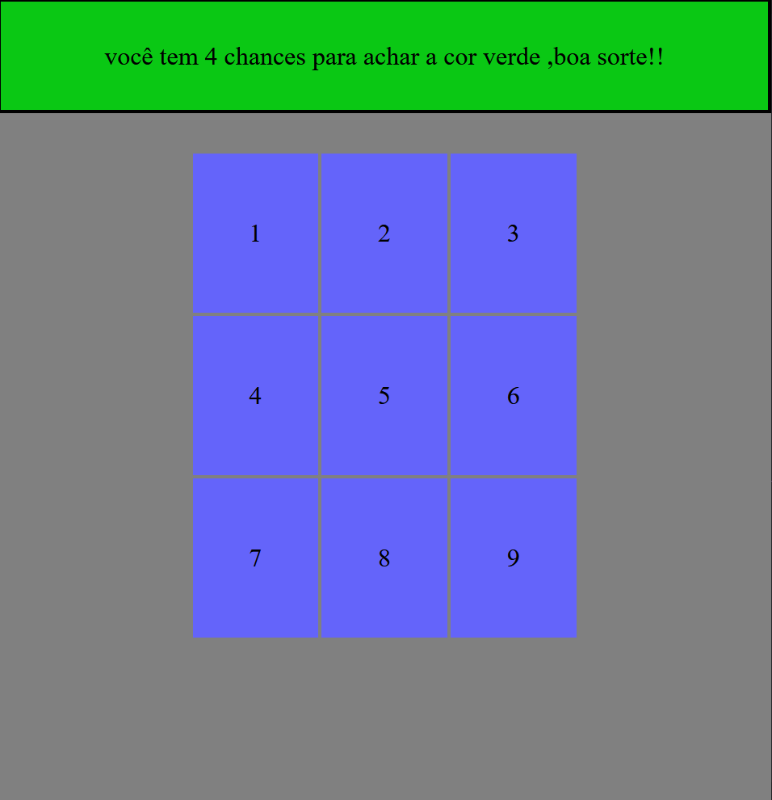
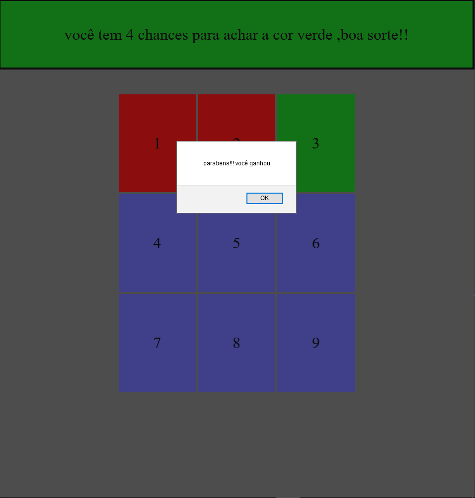
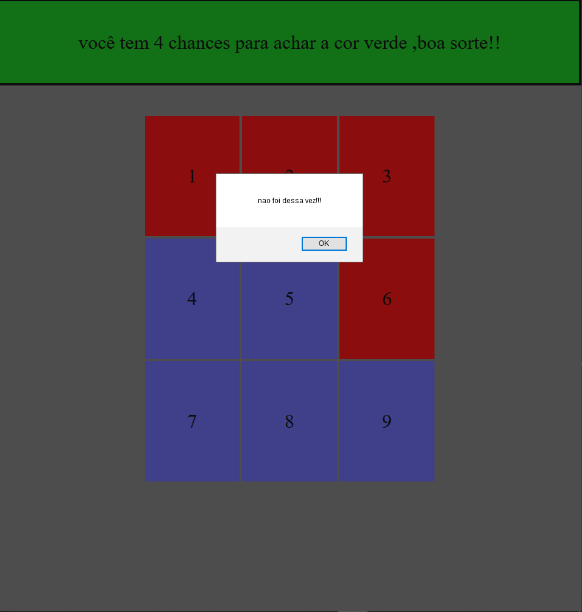

<h1>jogo encontre a cor</h1>

<h3>sobre a aplicação</h3>

essa aplicação é um jogo, onde o jogador deve encontrar a cor verde. Para isso ele tem 4 chances de 9 possibilidades, a cada chane utilizada o tabuleiro é preencido com a cor vermelho onde o clique aconteceu,se isso acontecer 4 vezes o jogador perde, mas se o clique acontecer na posição correta(sorteada aleatorriamente) o jogador ganha. 

<h3>ideias para implementar</h3>
 <li>aumentar o  tabuleiro.</li>
<li> modo com 2 ou mais jogadores.</li>
<li> usar icones ou imagens no lugar das cores.</li>
<li> mais...</li>